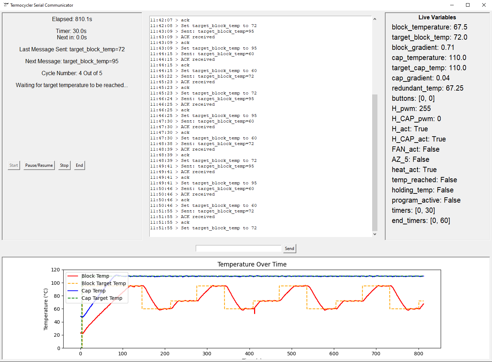
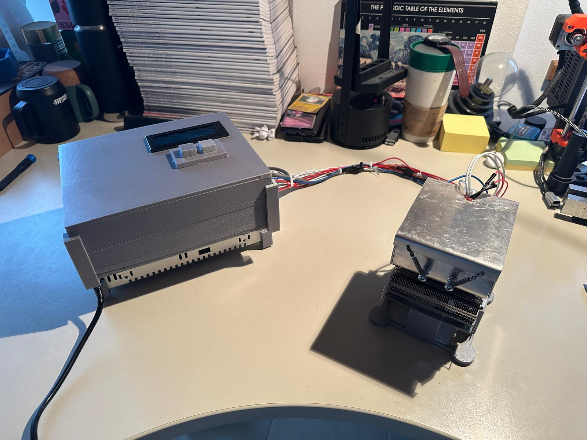
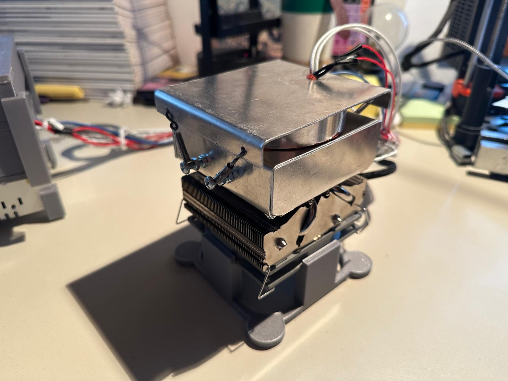
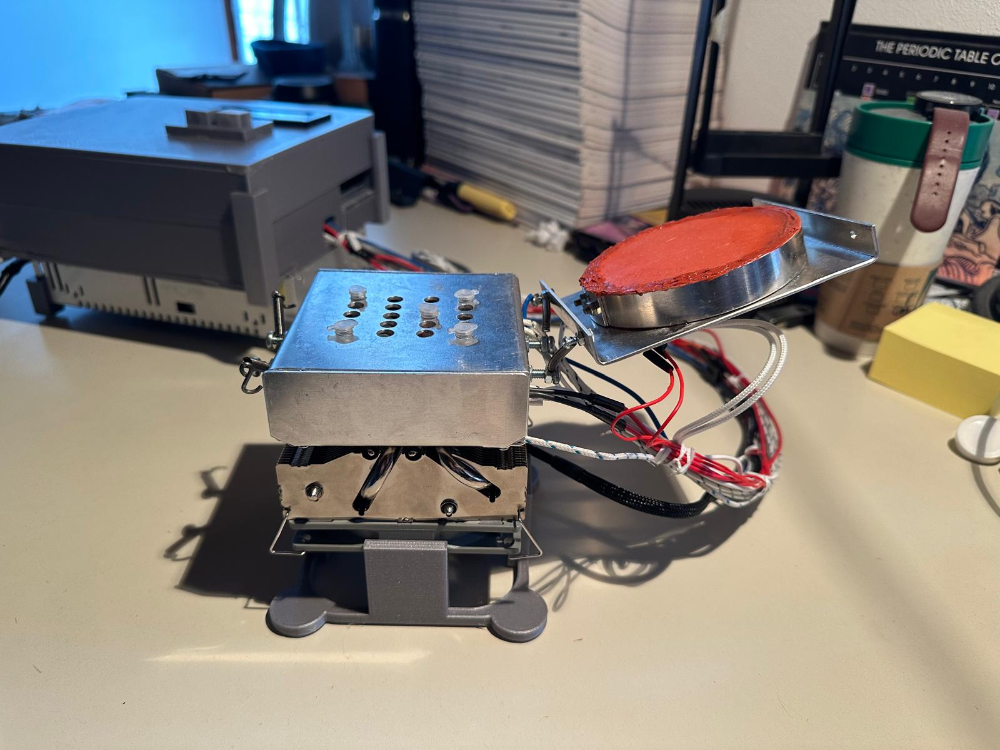
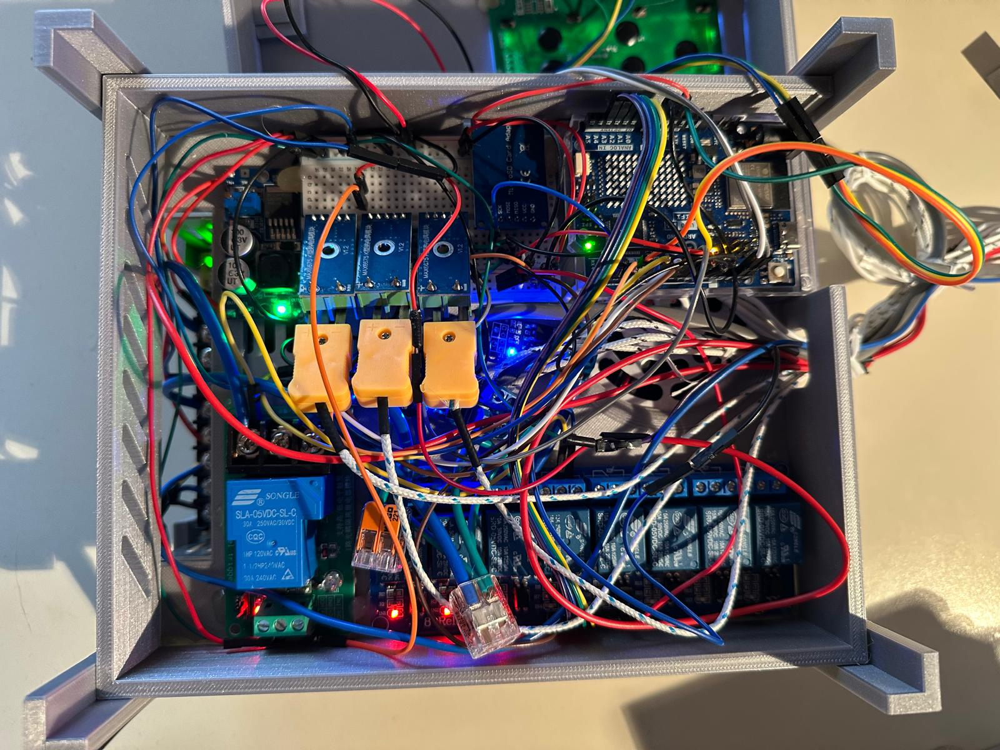
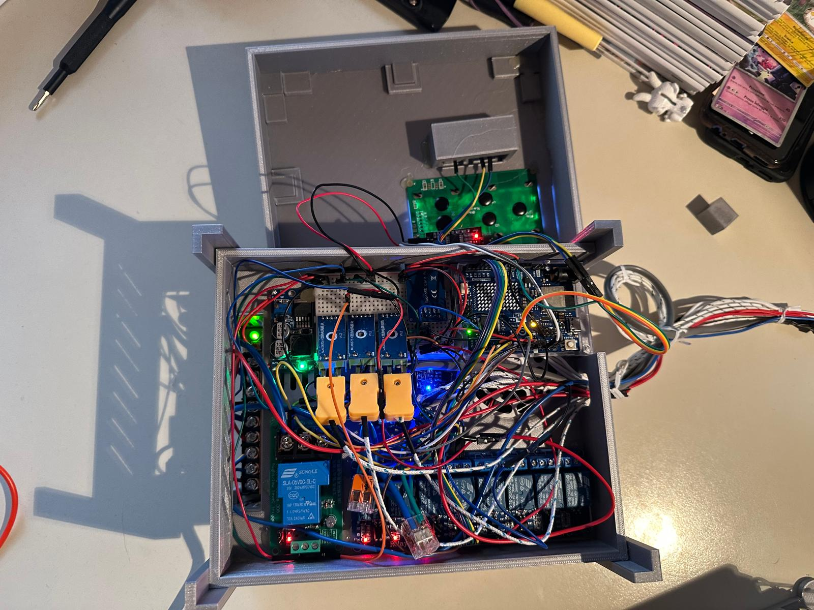
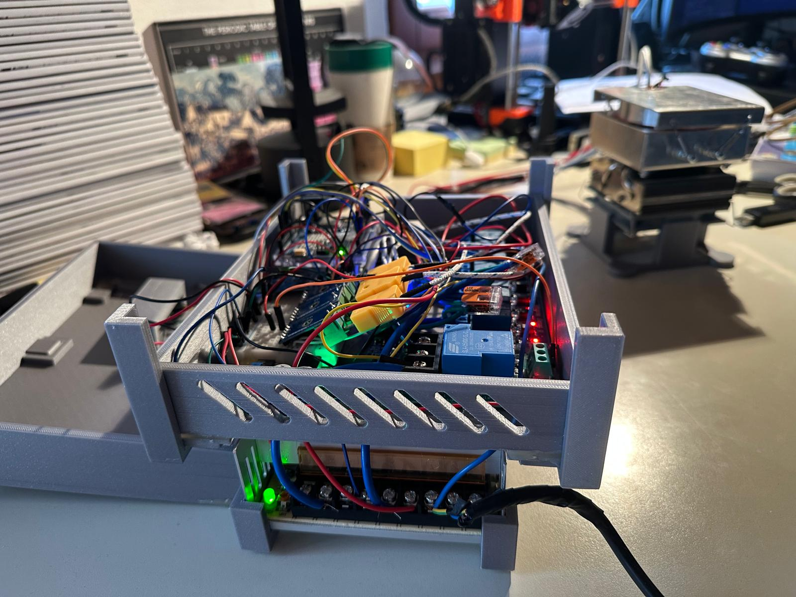

# PCR_Thermocycler

## Table of Contents
- [Overview](#overview)
- [Features](#features)
- [Hardware Requirements](#hardware-requirements)
- [Software Requirements](#software-requirements)
- [Installation](#installation)
- [Usage](#usage)
- [Examples](#examples)
- [Build photos](#build-photos)
- [License](#license)


## Overview
PCR_Thermocycler is a DIY project for building a programmable PCR (Polymerase Chain Reaction) thermocycler. This device allows precise temperature control for DNA amplification.

## Features
- Programmable temperature cycles
- LCD display
- User-friendly interface
- Serial communication for real-time monitoring and control
- Data logging to SD card
- Open-source hardware and software
- Compact and cost-effective design

## Hardware Requirements
All hardware components and schematics are listed in the `hardware/` directory.

## Software Requirements
- Arduino IDE
- Required libraries (see `software/Arduino_libraries/` and `software/requirements.txt`)
- Python 3.10.1 or higher (for the GUI)

## Installation
1. Clone this repository:
    ```bash
    git clone https://github.com/ale-giustina/PCR_Thermocycler.git
    ```
2. Assemble the hardware as per the schematics in the `hardware/` directory.
3. Open the firmware in Arduino IDE and upload it to your microcontroller.

## Usage
The device can be controlled via the LCD interface or through a Python GUI. The GUI allows for easy monitoring of the current status.

### Serial Mode
From the GIU you can change in real time the values of some variables seen on the right panel, such as temperature goals, heat activations and safety switches.
1. Connect the device to your computer via USB.
2. launch serial_comm.py, first setting the correct hwid in the code.
3. Click "Start" to begin the PCR process.
To edit cycles you must first edit the code in the cycle_controller function, where you can set the number of cycles and the temperature for each step.
4. The GUI will graph the temperature over time, providing real-time feedback on the PCR process and also show all the debug variables in the right panel.

### Standalone Mode
The device can also be used in standalone mode, where it will run a pre-programmed cycle without the need for a computer. To do this, you'll need to modify the firmware code in `software/firmware/` to set the desired temperature and time for each cycle. Activating the cycle in Standalone mode will not disturb Serial mode monitoring which can be used simultaneously, but if a cycle is activated from the serial interface (while a standalone cycle is active) the device will get overwhelmed as it will try to run both at the same time. 
The cycle number and extension period can be set directly from the LCD interface (you can hold the change button to reset a given value).
1. Start the device and wait for the LCD to display the main menu.
2. Pressing the left button will allow you to set the cycle number and extension period.
3. Pressing the right button will start the cycle.
4. The LCD will display the current temperature, the target temperature, the fan status(F) the pwm status for the body heaters(P) and time remaining for each step of the cycle.
5. The device will automatically switch between heating and cooling phases as per the programmed cycle.
6. By pressing the right button a cycle can be interrupted, going directly to the holding period.
7. Once the cycle is complete, the device will have a holding period at 72°C that can be configured in the `software/firmware/` and after cooling return to the main menu.


## Safety
### Hardware Safety
The device has three thermocouples for temperature monitoring. The first two are used to moonitor the temperature of the block, while the second one is used to check the temperature of the cap. 
To account for a thermocouple failure the device has 2 safety switches that will activate if the temperature exceeds 140°C cutting all the power to the heaters.
### Software Safety
The software has multiple safety checks to ensure that the device operates within safe limits. If any of these checks fail, the device will stop and display an error message on the LCD. A hard reset is required to restart the device.
- **User shutdown**: The user can stop the device at any time by pressing both button simultaneously for 4 seconds.
- **Over-temperature**: If the temperature exceeds 130°C, the device will lock and display an error message.
- **Redundant thermocouple**: If the temperature of the two block thermocouples is different by more than 15°C, the device will lock and display an error message.
- **Sensor failure**: If the temperature of the block thermocouple is below 0°C or NaN, the device will lock and display an error message.
- **Temperature timeout**: If a temperature change step is not completed within 5 minutes, the device will lock and display an error message (only works in Standalone mode).

## Examples
### Example 1: Basic Cycle
Graph from the GUI showing a basic PCR cycle with denaturation, annealing, and extension steps.


Graph from the sd log system showing PCR cycles started from the GUI and from standalone mode.


More examples can be found in the `Example_logs/` directory.

## Schematics
All schematics can be found in the `hardware/` directory.
They are divided into:
- **Thermocycler V2 Drawing**: The aluminum main body.
- **Thermocycler_build**: The control board and the wiring.
- **Bracket_holder**: The bracket for the aluminum body.

All the parts were created using Fusion 360 and can be found in the `hardware/` directory. The files are in .f3d format, which can be opened with Fusion 360.
The material used for the aluminum block is 6061 aluminum, the body is made of 1.5mm aluminum sheet and all the rest is 3d printed using prusament PLA.

## Build photos
More photos of the build process can be found in the `build_photos/` directory.

Complete build:




Internal view:




## License
This project is licensed under the MIT License. See [LICENSE](LICENSE) for details.
